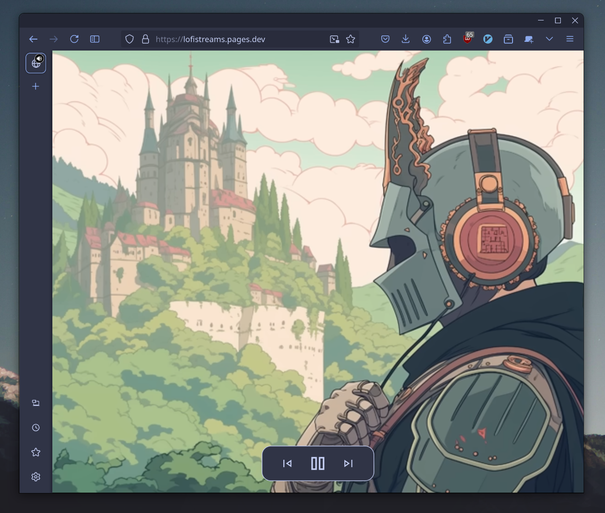

# Lofi Streams

A web app for your lofi listening needs! I made this project 
over a couple of hours, so that all my lofi listening tastes
could be accessed in one spot.

## Technology

With the idea of keeping the website lightweight, but wanting
the ease of development a framework brings, I opted to use 
mithril.js and tailwindcss. 

Streaming of the youtube video is done through the js api of
youtubes embeded videos.

## Deployment

The web app is hosted using Cloudflares Pages platform, which 
also supplies a nice https connection and domain. The app
can be found at https://lofistreams.pages.dev
